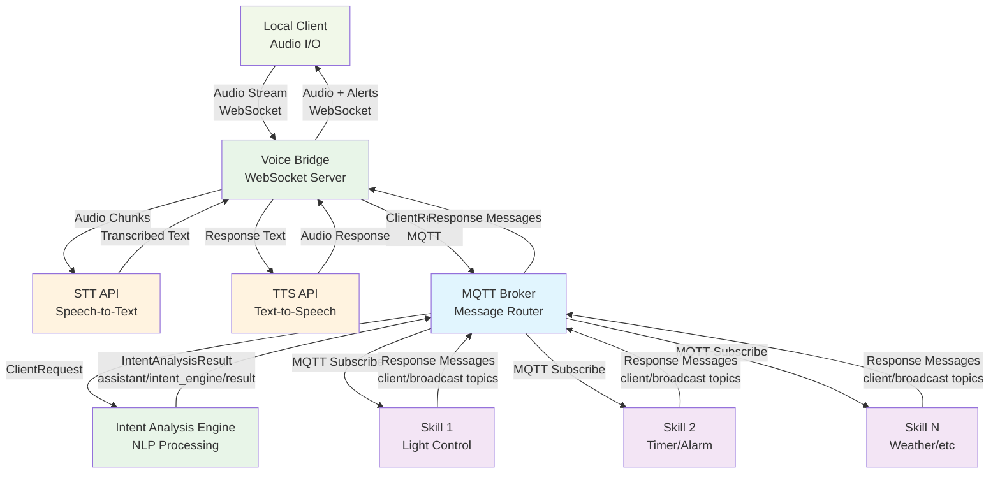
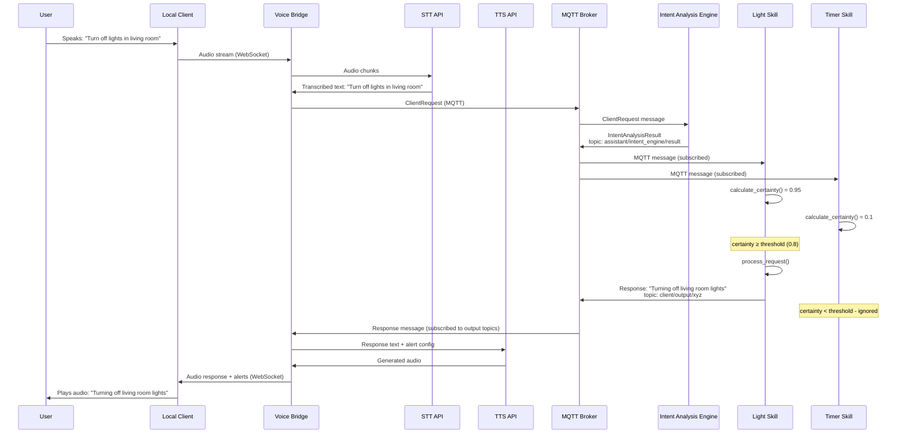

# Private Assistant Commons - Architecture Guide

## System Overview

Private Assistant Commons is a foundational library for building a distributed, local voice assistant system. The system processes voice commands for home automation through modular "skills" that communicate via MQTT messaging.

### Key Characteristics

- **Local & Private**: Runs entirely on local infrastructure (typically Kubernetes)
- **Distributed Processing**: No central coordinator - skills decide independently whether to handle requests
- **MQTT-Based**: All communication via structured MQTT messages using Pydantic models
- **Async & Concurrent**: Built on asyncio with TaskGroup for concurrent operations
- **Extensible**: Skills can be added/removed without system changes

## Architecture Components



## Core Architectural Patterns

### 1. Distributed Skill Processing

**No Central Coordinator**: Originally the system had a coordinator that selected which skill should handle each request. This was removed to reduce latency.

**Current Flow**:
1. Intent Analysis Engine processes voice command → `IntentAnalysisResult`
2. All skills receive the message via MQTT
3. Each skill calculates its certainty score independently
4. Skills with certainty ≥ threshold process the request
5. Multiple skills can respond to the same request (rare but acceptable)

**Benefits**:
- Lower latency (no coordinator round-trip)
- Better fault tolerance (no single point of failure)
- Simpler architecture

### 2. Message-Driven Communication

All system components communicate via MQTT using structured Pydantic models:

- **ClientRequest**: Original voice command + metadata
- **IntentAnalysisResult**: Parsed command with extracted intents
- **Response**: Skill output with optional audio alerts

### 3. Certainty-Based Processing

Skills implement `calculate_certainty()` to score their confidence in handling a request:

- **Simple keyword matching** (most common): Check for specific words/phrases
- **Complex analysis**: Multiple factors like verbs, nouns, context
- **Threshold filtering**: Only process if certainty ≥ configured threshold (default 0.8)

### 4. Location-Aware Processing

The system distinguishes between command origin and target:

- **ClientRequest.room**: Where the command was spoken ("kitchen")
- **IntentAnalysisResult.rooms**: Target locations ("living room" for "turn off lights in living room")
- **Fallback behavior**: Skills use origin room when no target specified

### 5. Task Management & Concurrency

Skills use `asyncio.TaskGroup` for concurrent operations:

- **MQTT message handling**: Main loop processes incoming messages
- **Background tasks**: Timers, delayed responses, concurrent API calls
- **Lifecycle management**: Tasks are properly cleaned up on skill shutdown

**Common Patterns**:
```python
# Spawn a timer task
self.add_task(self._timer_task(duration, message))

# Background API call
self.add_task(self._fetch_weather_data())
```

## Data Flow

### Voice Command Processing



**Detailed Flow:**
1. **Voice Capture**: User speaks to Local Client, which streams audio to Voice Bridge via WebSocket
2. **Speech-to-Text**: Voice Bridge sends audio chunks to local STT API for transcription
3. **MQTT Publishing**: Voice Bridge publishes `ClientRequest` with transcribed text to MQTT broker
4. **Intent Analysis**: Intent Analysis Engine receives `ClientRequest` and publishes `IntentAnalysisResult` to MQTT
5. **Distributed Processing**: All skills receive the `IntentAnalysisResult` via their MQTT subscriptions
6. **Certainty Evaluation**: Each skill calculates confidence score independently
7. **Selective Processing**: Only skills with certainty ≥ threshold process the request
8. **Response Publishing**: Processing skill publishes `Response` to appropriate MQTT topic
9. **Text-to-Speech**: Voice Bridge receives response, sends text to local TTS API for audio generation
10. **Audio Output**: Voice Bridge streams generated audio + alerts back to Local Client via WebSocket

### Message Routing

- **Targeted responses**: `skill.send_response(text, client_request)`
  - Uses `client_request.output_topic`
  - Sent to specific user/device
- **Broadcast responses**: `skill.broadcast_response(text)`
  - Uses `config.broadcast_topic`  
  - Sent to all connected clients

## Skill Lifecycle

### Initialization
```python
async def mqtt_connection_handler(skill_class, config, **kwargs):
    # 1. Establish MQTT connection with retry logic
    # 2. Create TaskGroup for concurrent operations
    # 3. Initialize skill instance
    # 4. Setup MQTT subscriptions
    # 5. Call skill_preparations() for custom setup
    # 6. Start message listening loop
```

### Runtime
```python
# Main message loop
async def listen_to_messages():
    async for message in mqtt_client.messages:
        if message.topic.matches(intent_topic):
            await handle_client_request_message(payload)

# Request processing pipeline  
async def handle_client_request_message(payload):
    result = IntentAnalysisResult.parse(payload)
    certainty = await calculate_certainty(result)
    if certainty >= threshold:
        await process_request(result)
```

## Integration Points

### MQTT Topics
- **Intent Results**: `assistant/intent_engine/result`
- **Broadcast**: `assistant/comms_bridge/broadcast`  
- **Skill Feedback**: `assistant/{skill_id}/feedback`

### External Systems
- **Voice Bridge**: Audio input/output via FastAPI WebSocket
- **Databases**: Optional PostgreSQL for skill persistence
- **APIs**: Skills can integrate with external services

## Configuration Management

Skills use `SkillConfig` for:
- MQTT connection settings
- Topic hierarchy configuration
- Skill-specific settings via YAML files

Optional `PostgresConfig` for skills requiring persistence:
- Token storage (e.g., Spotify authentication)
- User preferences
- Historical data

## Error Handling

### MQTT Resilience
- Automatic reconnection on connection loss
- Configurable retry intervals
- Graceful degradation when services unavailable

### Skill Robustness
- Pydantic validation for all messages
- Structured exception handling
- Comprehensive logging with configurable levels

### Task Management
- TaskGroup automatically handles task cleanup
- Proper cancellation handling
- Resource cleanup on skill shutdown

## Performance Considerations

### Message Processing
- Lightweight certainty calculations for fast filtering
- Async/await throughout for non-blocking operations
- Bounded LRU cache prevents memory leaks with automatic eviction
- Concurrent message processing for improved throughput (2-3x improvement)
- Thread-safe cache access with asyncio.Lock for data integrity

### Resource Management
- Skills only process relevant messages
- Background tasks managed by TaskGroup
- Optional database connections only when needed
- Configurable intent cache size (default: 1000 entries)
- Memory usage remains stable during long-running operations

### Scalability
- Horizontal: Add more skill instances
- Vertical: Skills process multiple messages concurrently
- Topic-based message filtering reduces processing overhead
- Individual message processing errors don't affect other messages

## Security & Privacy

### Local Processing
- No cloud dependencies
- All data stays on local network
- Voice processing entirely local

### Message Security
- MQTT over local network only
- Structured message validation
- No sensitive data in logs

This architecture provides a robust, scalable foundation for building sophisticated voice assistant capabilities while maintaining privacy and local control.